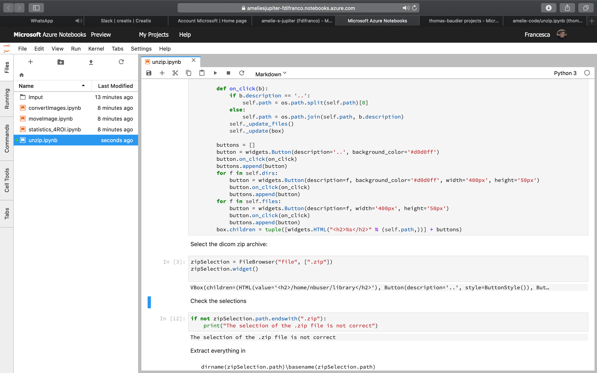
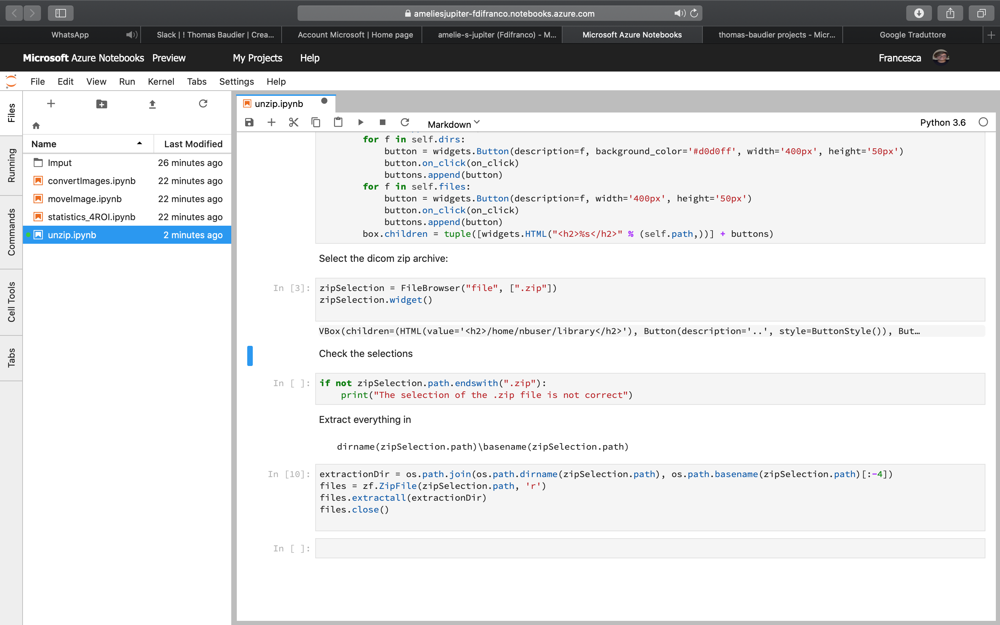

# How to configure Jupyter Notebook on Azure

  

## Create an account

  

You can create an account on:

[https://notebooks.azure.com/](https://notebooks.azure.com/)

  

And you can upload your notebooks or create your first one. Open one Notebook and you should see something like that:

  



  

With Python 3 written in the top right corner.

First we need to open it with Python 3.6. So click on:

```

Kernel, and choose Change Kernel, and Python3.6

```

  

Now you can see Python 3.6 on the top right:



  

## Install requiere packages:

  

Click on

````

File / Open

````

And you can see the following screen:

  


  

Click at the top right on

```

New / Terminal

```

And you can see in a new tab this:

  


  

You can execute the following lines in the terminal:

  

```

mkdir gateTools

git clone https://github.com/OpenGATE/GateTools.git gateTools/

cd gateTools/

/home/nbuser/anaconda3_501/bin/pip install --user -e .

```

  

The last line can take some minutes to install all require packages.

  

## Last few things:

  

Now you can come back to you preferred Jupyter Notebook and execute it. But you need to know 2 things:

1. If you open a new Jupyter Notebook, you should need to change the Python version from 3 to 3.6 (like in the first chapter)

2.  If you disconnect from Microsoft Azure, you should redo the installation of require packages (like in the second chapter)

3. If a package is missing, you can install it like in the second chapter:

```

Open a terminal

pip install --user <packageName>

```

  

> Written with [StackEdit](https://stackedit.io/).

<!--stackedit_data:

eyJoaXN0b3J5IjpbMTM3ODE3OTY1NF19
<!--stackedit_data:
eyJoaXN0b3J5IjpbMTAyNjgxMjk4Nl19
-->
